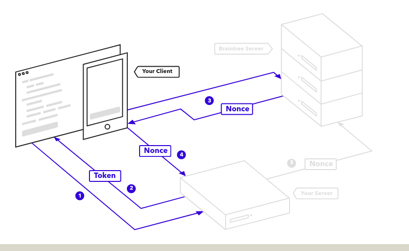
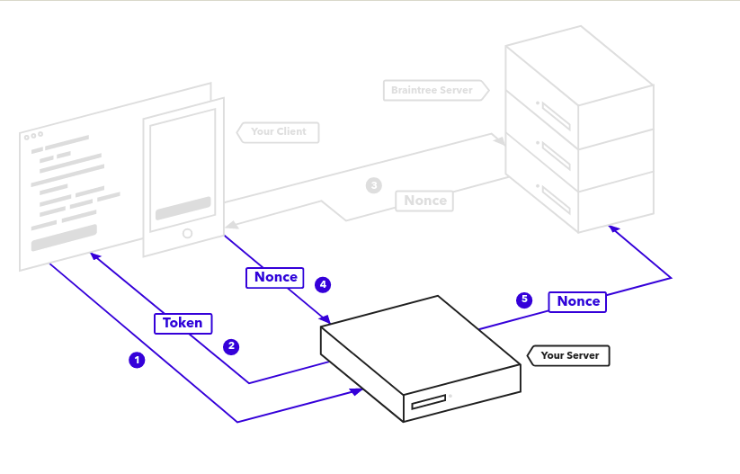

# Payment Gateway Module

## Paypal

### Flujo

1.- Construir la conexion con PayPal (Server)

        var gateway = braintree.connect({
            accessToken: useYourAccessToken
        });

`useYourAccessToken` es el Token de la agencia que se registra en PayPal. 

2.- Generaramos el ClienToken para que el cliente pueda realizar la transaccion con PayPal. (Server)

        const clientToken = await gateway.clientToken.generate({});

3.- Se genera el botón para realizar la Autorización con PayPal, incluyendo el Token y la información del pago para que se muestre la pantalla de Autorización de PayPal y pueda confirmar la operación. (Client)

        paypal.Button.render({
            braintree: braintree, // Modulo de NPM
            client: { 
                production: 'CLIENT_TOKEN_FROM_SERVER', // Token para producción
                sandbox: 'CLIENT_TOKEN_FROM_SERVER' // Token para realizar Test
            },
            env: 'production', // Elegir el entorno (production o sandbox)
            commit: true, // Esto agregara el importe al boton de PayPal
            payment: function (data, actions) {
                return actions.braintree.create({
                    flow: 'checkout', // Tipo de Flow
                    amount: 10.00, // Importe de la operación
                    currency: 'USD', // Moneda
                    enableShippingAddress: true, // Habilitar datos de envio
                    shippingAddressEditable: false, // habilitar edición de los datos de envio
                    shippingAddressOverride: { //Datos de envío
                        recipientName: 'Scruff McGruff',
                        line1: '1234 Main St.',
                        line2: 'Unit 1',
                        city: 'Chicago',
                        countryCode: 'US',
                        postalCode: '60652',
                        state: 'IL',
                        phone: '123.456.7890'
                    }
                });
            },
            onAuthorize: function (payload) { 
                // Si se ha autorizado nos devuelve un token `payload.nonce` para enviar al Servidor y finalizar la transacción
            },
        }, '#paypal-button');

4.- Con el `nonce` recibido se realiza una peticion a PayPal para que se realice el abono a la cuenta de la agencia.

        var saleRequest = {
            amount: req.body.amount,
            merchantAccountId: "USD",
            paymentMethodNonce: req.body.nonce,
            orderId: "Mapped to PayPal Invoice Number",
            descriptor: {
                name: "Descriptor displayed in customer CC statements. 22 char max"
            },
            shipping: {
                firstName: "Jen",
                lastName: "Smith",
                company: "Braintree",
                streetAddress: "1 E 1st St",
                extendedAddress: "5th Floor",
                locality: "Bartlett",
                region: "IL",
                postalCode: "60103",
                countryCodeAlpha2: "US"
            },
            options: {
                paypal: {
                customField: "PayPal custom field",
                description: "Description for PayPal email receipt"
                },
                submitForSettlement: true
            }
        };

        const {success , transaction } = await gateway.transaction.sale
        
        if (!success) 
            throw Error('Error in transaction.')

        transaction.status // "authorized"
        transaction.id 

            
### Flujo del Cliente

### Flujo del Servidor

